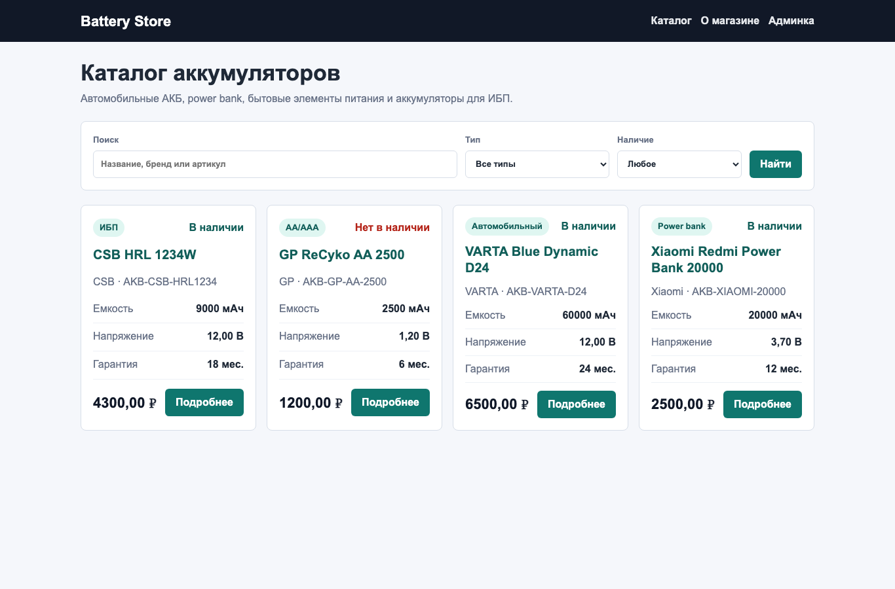
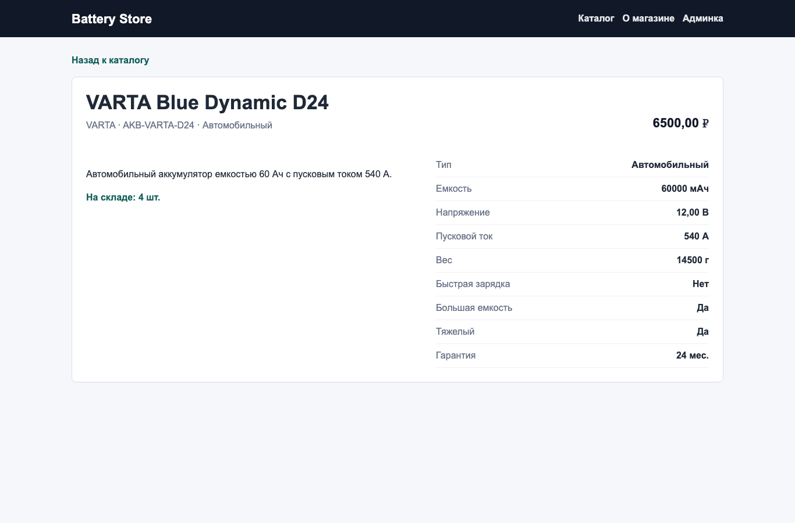

# Практическая работа 4. Проект каталог. База данных

Тема товара: **аккумулятор**.

## Что реализовано

Проект Django находится в папке `ПЗ4/catalog_project`.

Основные файлы исходного кода:

- `catalog/models.py` — модели `BatteryType` и `Battery`, ограничения полей, вычисляемые свойства, менеджеры.
- `catalog/admin.py` — настройка админки Django для типов аккумуляторов и товаров.
- `catalog/views.py` — список товаров и детальная страница берут данные из базы.
- `catalog/templates/catalog/` — страницы каталога, детальной карточки и страницы о магазине.
- `catalog/tests.py` — тесты моделей, связей, менеджеров, ограничений БД и представлений.
- `catalog/fixtures/battery_catalog.json` — тестовые типы и товары для загрузки в базу.
- `catalog/migrations/0001_initial.py` — миграция для создания таблиц.

## Структура модели товара

Для аккумулятора используются поля:

- артикул `sku` — строка, уникальное значение, только латинские заглавные буквы, цифры и дефисы;
- название `name` — строка;
- бренд `brand` — строка;
- тип аккумулятора `battery_type` — связь один-ко-многим с отдельной таблицей `BatteryType`;
- емкость `capacity_mah` — положительное число;
- напряжение `voltage_v` — положительное десятичное число;
- пусковой ток `starting_current_a` — положительное число, необязательное поле;
- вес `weight_grams` — положительное число, необязательное поле;
- цена `price` — положительное десятичное число;
- остаток `stock_quantity` — неотрицательное число;
- гарантия `warranty_months` — число от 0 до 120;
- поддержка быстрой зарядки `fast_charge` — логическое поле;
- описание `description` — текст.

Поле «один из» вынесено в отдельную таблицу `BatteryType`. Связь настроена через `ForeignKey` с `on_delete=PROTECT`, чтобы нельзя было удалить тип, к которому привязаны товары.

## Скриншоты страниц

Список товаров:



Детальная страница товара:



## Чек-лист требований

- [x] Созданы модели для хранения товаров.
- [x] Для поля «тип аккумулятора» создана отдельная модель `BatteryType`.
- [x] Настроена связь один-ко-многим: один тип аккумулятора может иметь много товаров.
- [x] Добавлены ограничения допустимых значений через validators и `CheckConstraint`.
- [x] Настроена админка Django: поиск, фильтрация, редактируемые поля, регистрация моделей.
- [x] Список товаров на главной странице берется из базы данных.
- [x] Детальная страница товара берет данные из базы данных.
- [x] На странице списка есть поиск по названию, бренду, артикулу и описанию.
- [x] На странице списка есть фильтрация по типу и наличию.
- [x] Возможность добавить, удалить и редактировать товар доступна через админку.
- [x] Подготовлена фикстура с тестовыми данными.
- [x] Написано не менее 10 тестов: выполнен 21 тест.

## Тесты

Команда запуска:

```bash
cd ПЗ4/catalog_project
python3 manage.py test
```

Результат проверки:

```text
Ran 21 tests
OK
```

В тестах проверяется:

- валидация положительных чисел: цена, емкость, вес;
- уникальность артикула;
- формат артикула;
- связь `BatteryType` -> `Battery`;
- защита удаления типа через `on_delete=PROTECT`;
- вычисляемые свойства `is_heavy` и `is_high_capacity`;
- менеджеры `by_type()`, `in_stock()`, `heavy()`;
- ограничения уровня БД: положительная цена, положительная емкость, уникальный артикул;
- работа списка товаров, детальной страницы, поиска и фильтрации.

## Запуск проекта

```bash
cd ПЗ4/catalog_project
python3 manage.py migrate
python3 manage.py loaddata battery_catalog
python3 manage.py runserver 127.0.0.1:8004
```

После запуска:

- каталог: `http://127.0.0.1:8004/`
- админка: `http://127.0.0.1:8004/admin/`

Для входа в админку нужен суперпользователь:

```bash
python3 manage.py createsuperuser
```
