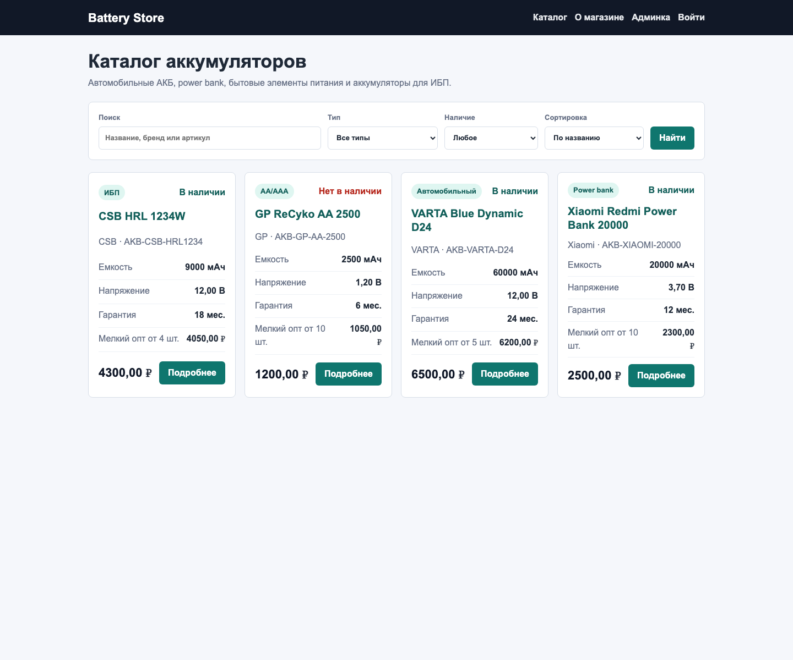
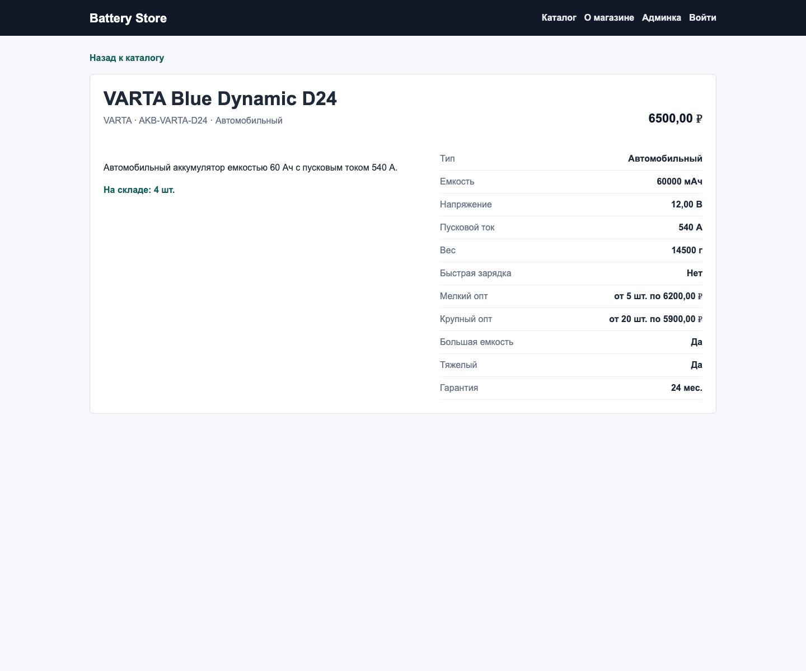
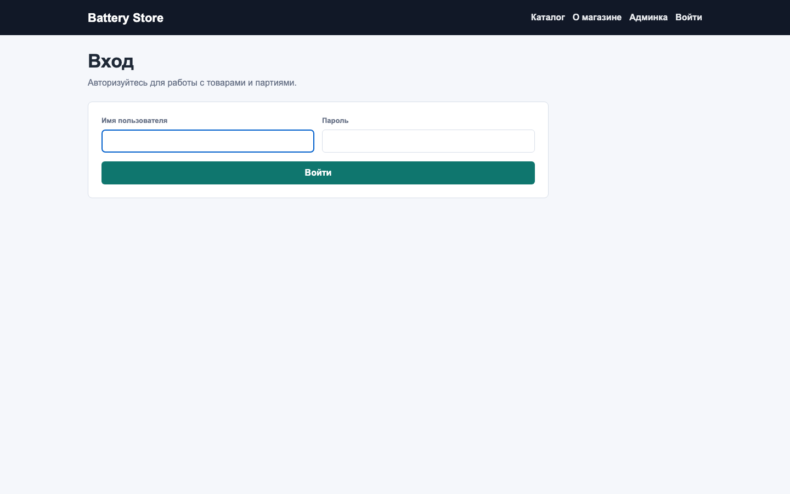
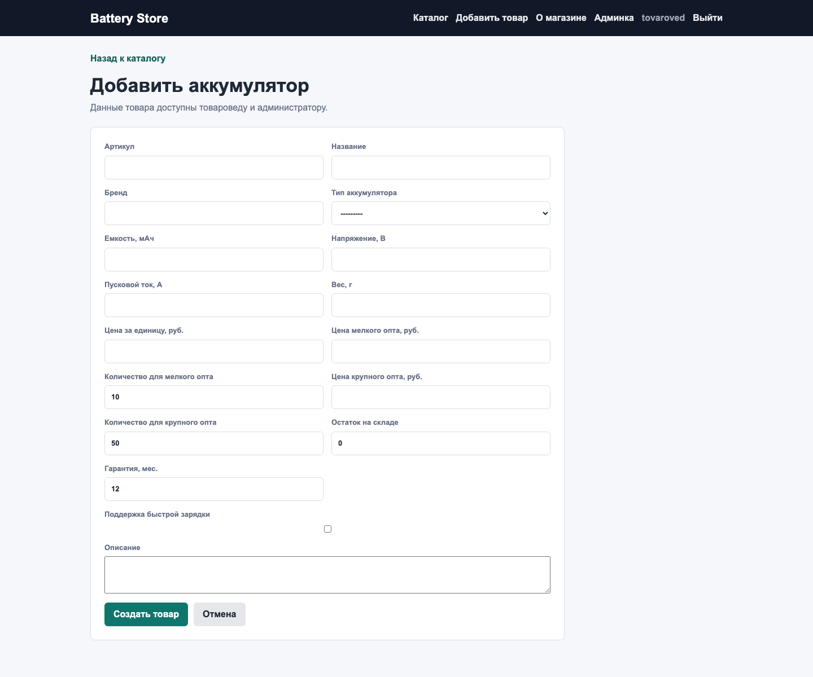
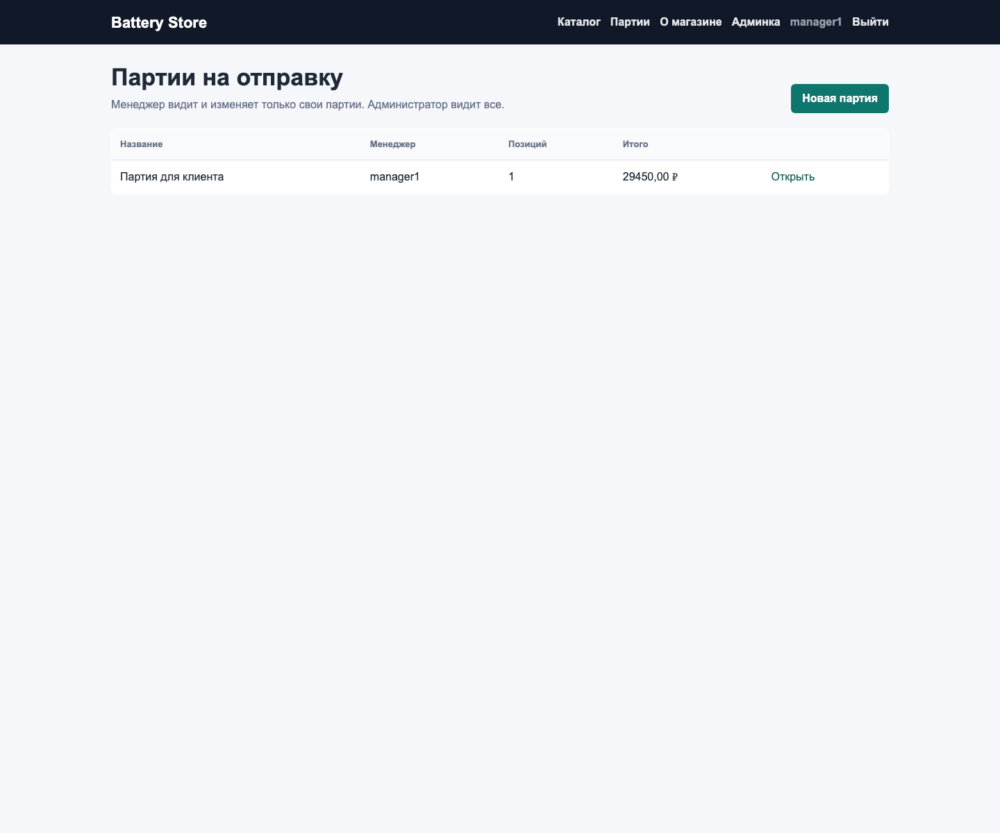
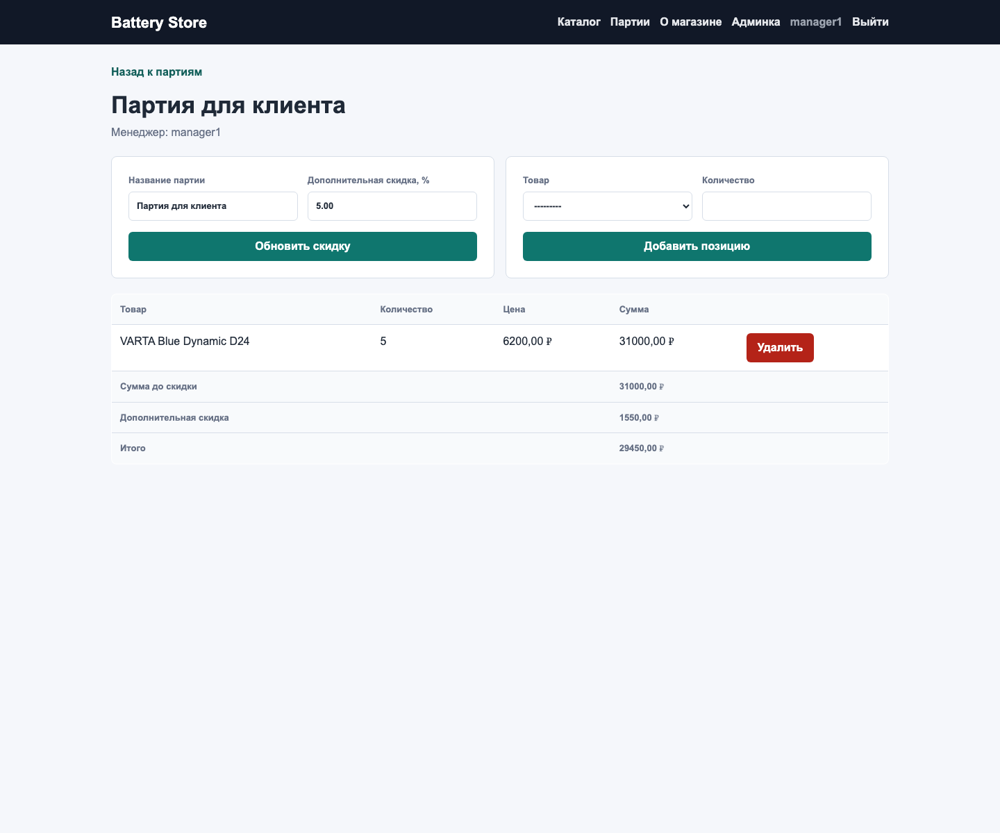

# Практическая работа 6. Проект каталог. Работа с данными

Студент: Фёдоров Антон Сергеевич.  
Вариант: 25.  
Товар: аккумулятор.

## Что реализовано

Проект Django находится в папке `ПЗ6/catalog_project`.

Добавлен функционал работы с данными каталога:

- роли пользователей: администратор, товаровед, менеджер продаж, гость;
- пользовательские формы создания, редактирования и удаления товара;
- поля оптового ценообразования для аккумулятора;
- партии товара на отправку, которые формирует менеджер;
- расчет суммы партии с учетом мелкого/крупного опта и дополнительной скидки;
- запрет изменения чужой партии другим менеджером;
- тесты ролей, форм, POST-запросов, маршрутов и расчета партии.

## Исходный код

Основные файлы:

- `catalog/models.py` — модели `Battery`, `Shipment`, `ShipmentItem`, расчет цен и итогов партии;
- `catalog/forms.py` — формы товара, партии и позиции партии;
- `catalog/views.py` — каталог, CRUD товара, партии, проверка ролей;
- `catalog/urls.py` — маршруты каталога, товара и партий;
- `catalog/admin.py` — регистрация товаров, типов и партий в Django admin;
- `catalog/templates/catalog/product_form.html` — форма создания/редактирования товара;
- `catalog/templates/catalog/product_confirm_delete.html` — подтверждение удаления товара;
- `catalog/templates/catalog/shipment_list.html` — список партий;
- `catalog/templates/catalog/shipment_detail.html` — карточка партии и расчет суммы;
- `catalog/templates/registration/login.html` — страница входа;
- `catalog/tests/test_forms.py` — тесты формы товара;
- `catalog/tests/test_roles_and_shipments.py` — тесты ролей, POST-операций и расчета партии;
- `catalog/tests/test_routes.py` — тесты маршрутов;
- `catalog/tests/test_content.py` — тесты контента каталога из ПЗ5.

## Роли

| Роль | Реализация | Возможности |
| --- | --- | --- |
| Администратор | `is_superuser=True` | Может работать с товарами и открывать партии менеджеров |
| Товаровед | группа `Товароведы` | Может создавать, редактировать и удалять товары |
| Менеджер продаж | группа `Менеджеры продаж` | Может создавать и изменять только свои партии |
| Гость | неавторизованный пользователь | Может только просматривать каталог |

## Работа с ценами

В товар добавлены поля:

- `price` — цена за единицу;
- `small_wholesale_price` — цена мелкого опта;
- `small_wholesale_min_quantity` — количество для мелкого опта;
- `large_wholesale_price` — цена крупного опта;
- `large_wholesale_min_quantity` — количество для крупного опта.

Метод `Battery.get_price_for_quantity(quantity)` выбирает цену по количеству. Партия суммирует позиции и применяет `additional_discount_percent` к общей сумме.

## Скриншоты

Каталог:



Карточка товара:



Страница входа:



Форма товара для товароведа:



Список партий менеджера:



Карточка партии и расчет:



## Перечень тестов

`test_forms.py`:

- проверяет валидную форму товара;
- проверяет создание товара через форму;
- проверяет запрет дублирования артикула;
- проверяет, что цена мелкого опта не выше цены за единицу;
- проверяет, что цена крупного опта не выше цены мелкого опта;
- проверяет, что порог крупного опта больше порога мелкого опта.

`test_roles_and_shipments.py`:

- проверяет, что гость может только просматривать страницы;
- проверяет, что менеджер не может управлять товарами;
- проверяет создание, редактирование и удаление товара товароведом;
- проверяет доступ администратора к управлению товарами;
- проверяет создание партии менеджером;
- проверяет добавление товара в свою партию;
- проверяет, что менеджер видит только свои партии;
- проверяет, что другой менеджер не может изменить чужую партию;
- проверяет доступ администратора к чужой партии;
- проверяет расчет суммы партии с оптовыми ценами и общей скидкой;
- проверяет изменение дополнительной скидки партии.

`test_routes.py`:

- проверяет `reverse()` и `resolve()` для каталога, товара, CRUD товара и партий;
- проверяет GET-статусы открытых страниц;
- проверяет 404 для несуществующего товара.

`test_content.py`:

- проверяет шаблоны, контекст, поиск, фильтрацию, сортировки и About.

## Результат запуска тестов

Команда:

```bash
python3 manage.py test catalog.tests --verbosity=2
```

Результат:

```text
Found 46 test(s).
Ran 46 tests in 6.037s
OK
```

Покрытие:

```bash
coverage run --source='.' manage.py test catalog.tests
coverage report
```

```text
TOTAL 679 29 96%
```

## Данные для ручной проверки

Локальные пользователи:

- администратор: `admin` / `admin12345`;
- товаровед: `tovaroved` / `worker12345`;
- менеджер продаж: `manager1` / `manager12345`;
- второй менеджер продаж: `manager2` / `manager12345`.

Перед запуском:

```bash
cd ПЗ6/catalog_project
python3 manage.py migrate
python3 manage.py loaddata battery_catalog
python3 manage.py runserver 127.0.0.1:8006
```
