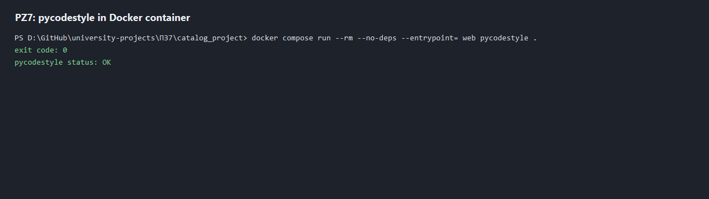
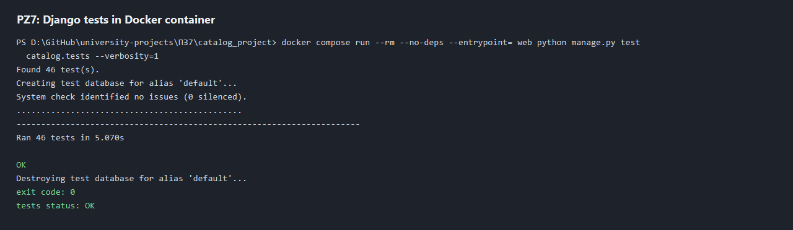

# Практическая работа 7. Проект каталог. Подготовка к бою

Студент: Фёдоров Антон Сергеевич.  
Вариант: 25.  
Товар: аккумулятор.

## Что реализовано

Проект Django находится в папке `ПЗ7/catalog_project`.

Для подготовки проекта к запуску вне машины разработчика добавлены:

- Docker-образ Django-приложения на Python 3.12;
- WSGI-сервер `gunicorn`;
- nginx как отдельный контейнер-прокси;
- `docker-compose.yml` для запуска связки nginx + Django;
- внешний Docker volume `catalog_db` для файла SQLite `/data/db.sqlite3`;
- внешний Docker volume `static_files` для собранной статики;
- entrypoint, который выполняет миграции, собирает статику и загружает фикстуры каталога;
- `pycodestyle` для проверки PEP8;
- скриншоты успешного запуска линтера и тестов в контейнере.

## Docker-файлы

### `catalog_project/Dockerfile`

```dockerfile
FROM python:3.12-slim

ENV PYTHONDONTWRITEBYTECODE=1 \
    PYTHONUNBUFFERED=1

WORKDIR /app

RUN addgroup --system django \
    && adduser --system --ingroup django django \
    && mkdir -p /data /static \
    && chown -R django:django /data /static /app

COPY requirements.txt .
RUN pip install --no-cache-dir -r requirements.txt

COPY --chown=django:django . .
RUN chmod +x /app/scripts/entrypoint.sh

USER django

EXPOSE 8000

ENTRYPOINT ["/app/scripts/entrypoint.sh"]
CMD ["gunicorn", "catalog_project.wsgi:application", "--bind", "0.0.0.0:8000", "--workers", "3"]
```

### `catalog_project/docker-compose.yml`

```yaml
services:
  web:
    build: .
    image: pz7-catalog-web
    restart: unless-stopped
    environment:
      DJANGO_DEBUG: "False"
      DJANGO_ALLOWED_HOSTS: "localhost,127.0.0.1,web"
      DJANGO_DB_PATH: "/data/db.sqlite3"
      DJANGO_STATIC_ROOT: "/static"
      DJANGO_SECRET_KEY: "pz7-local-docker-secret-key"
    volumes:
      - catalog_db:/data
      - static_files:/static

  nginx:
    image: nginx:1.27-alpine
    restart: unless-stopped
    depends_on:
      - web
    ports:
      - "8087:80"
    volumes:
      - ./nginx/default.conf:/etc/nginx/conf.d/default.conf:ro
      - static_files:/static:ro

volumes:
  catalog_db:
  static_files:
```

### `catalog_project/nginx/default.conf`

```nginx
upstream django_app {
    server web:8000;
}

server {
    listen 80;
    server_name localhost;

    client_max_body_size 10m;

    location /static/ {
        alias /static/;
        access_log off;
        expires 30d;
    }

    location / {
        proxy_pass http://django_app;
        proxy_set_header Host $host;
        proxy_set_header X-Real-IP $remote_addr;
        proxy_set_header X-Forwarded-For $proxy_add_x_forwarded_for;
        proxy_set_header X-Forwarded-Proto $scheme;
    }
}
```

### `catalog_project/scripts/entrypoint.sh`

```sh
#!/bin/sh
set -e

python manage.py migrate --noinput
python manage.py collectstatic --noinput
python manage.py loaddata battery_catalog

exec "$@"
```

### `catalog_project/requirements.txt`

```text
Django==4.2.11
gunicorn==23.0.0
pycodestyle==2.14.0
```

## Команды запуска

Сборка образа:

```bash
docker compose build
```

Запуск двух контейнеров:

```bash
docker compose up -d
```

Проверка приложения через nginx:

```bash
Invoke-WebRequest -Uri 'http://127.0.0.1:8087/' -UseBasicParsing
```

Результат проверки: HTTP 200. Контейнеры `web` и `nginx` находятся в статусе `Up`.

Проверка, что база данных находится во внешнем volume:

```bash
docker compose exec -T web sh -c "ls -l /data && test -f /data/db.sqlite3 && echo DB_FILE_OK"
```

Результат: файл `/data/db.sqlite3` создан в volume `catalog_project_catalog_db`.

## Линтер

Команда запуска линтера в контейнере:

```bash
docker compose run --rm --no-deps --entrypoint= web pycodestyle .
```

Результат: `exit code: 0`, `pycodestyle status: OK`.



## Тесты

Команда запуска тестов в контейнере:

```bash
docker compose run --rm --no-deps --entrypoint= web python manage.py test catalog.tests --verbosity=1
```

Результат: найдено 46 тестов, все тесты пройдены, `exit code: 0`, `tests status: OK`.



## Данные для ручной проверки

После запуска `docker compose up -d` каталог доступен по адресу:

```text
http://127.0.0.1:8087/
```

Остановка контейнеров:

```bash
docker compose down
```
